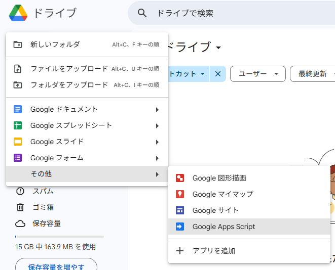

# 経費精算申請フォーム

## 概要
- Googleスプレッドシートと直接接続する改良版フォームです．
- 複数項目の送信，税率計算，申請先や購入場所の個別設定などに対応しています．
> このリポジトリ内のdocsはGitHub Pagesで公開されており，フォームのファビコンはここから取得しています．

## 更新履歴
- 2025-05-31:
  - ファイルをアップロード．
- 2025-07-07:
  - 項目(Category)選択機能を実装．
  - アイテムが常に1つ以上存在するように修正．
  - 未入力欄の赤枠表示の問題を修正．
  - 警告メッセージの色を修正．

## 引継ぎの方法

|N|CAPTION|
|:--|:--|
|||

|1|スプレッドシートの編集権限のあるアカウントでGoogleドライブを開く|
|:--|:--|
||**<a href="https://drive.google.com/drive/my-drive" target="_blank" rel="noopener noreferrer">Googleドライブ</a>**|

|2|「新規」→「その他」→「Google Apps Script」から新しくプロジェクトを作成する|
|:--|:--|
|||

|3|「スクリプトを作成」を選択する|
|:--|:--|
|||

|4|「無題のプロジェクト」の名前を変更する|
|:--|:--|
|||

|5|「＋」→「HTML」からファイルを追加する|
|:--|:--|
|||

|6|名前を「index」に変更する（「index.html」となれば良い」）|
|:--|:--|
|||

|7|同様に「script」「style」を追加する|
|:--|:--|
|||

|8|もとからある内容を全て消去し[ここ](/src)にある内容を全てコピーする|
|:--|:--|
|||

|9|「コード.gs」内の「会計担当者へ」の指示に従って必要事項を入力する|
|:--|:--|
|||

|10|「Ctrl+S」もしくはフロッピーディスクのボタンをクリックして保存する|
|:--|:--|
|||

|11|「デプロイ」→「新しいデプロイ」で新しいデプロイを作成する|
|:--|:--|
|||

|12|「種類の選択」の右側にある歯車マークをクリックし「ウェブアプリ」を選択する|
|:--|:--|
|||

|13|「説明」に新しい説明文（「1回目のデプロイ」など）を追加する|
|:--|:--|
|||

|14|「アクセスできるユーザー」を「全員」に変更する|
|:--|:--|
|||
