# 経費精算申請フォーム
➔ デモページは[**こちら**](https://script.google.com/macros/s/AKfycbzcfYVeeMSKhGk_sj8BYYwdl7ZLyvZTAJPf8Hb-x7IEZlEONKxFN-62XeHpFv2fPIF1cg/exec)

## 概要
- 東京理科大学鳥人間サークル鳥科で使用する，経費精算申請フォームの生成ライブラリです．
- Googleスプレッドシートと直接接続し，フォームから送信されたデータを安全に記録します．
- 複数項目の送信，税率計算，申請先や購入場所の個別設定などに対応しています．
- 何かあれば制作者に[XのDM](https://x.com/MeganeKinoko_)やメール(irongolem0100@gmail.com)などで連絡してください．
> [!NOTE]
> このリポジトリ内のdocsはGitHub Pagesで公開されており，フォームのファビコンはここから取得しています．

## 使い方
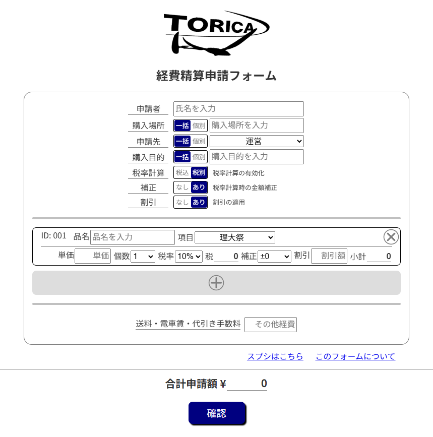<br>
<br>
以下，わかりにくいかもしれない部分に関する説明です．
### 「＋（プラスマーク）」ボタン
- 画面下部のこのボタンを押すと，新しいアイテムが追加され，複数の商品に関する内容を同時に送信することができます．
### - 「一括」「個別」入力切り替え機能
- 「一括」：すべてのアイテムに一括で内容を適用します．
- 「個別」：それぞれのアイテムに別々の内容を適用します．
### 税率計算機能
- 「税込」：税率計算機能は無効です．
- 「税抜」：税率計算機能が有効です．「税率」に従って自動的に計算されます．
### 「補正」について
- 販売店によっては，商品の合計金額に対して税率をかける場合があります．その場合，このフォーム上での税率計算後の金額と異なってしまうことがあります．
- フォーム上の合計金額と実際の合計金額の差を補正する際は，「補正」を「あり」に切り替えて税額を補正してください．
### 「スプシはこちら」について
- データ送信先のGoogleスプレッドシートを新しいタブ（またはウィンドウ）で開きます．
### 「このフォームについて」について
- このGitHubリポジトリを新しいタブ（またはウィンドウ）で開きます．

## 更新履歴
<details>
<summary><u>更新履歴を開く</u></summary>
<br>
<strong>2025-11-02:</strong>
<ul>
<li>「申請者」と「購入場所」，「購入目的」のデフォルトを設定する関数を追加．</li>
</ul>
<strong>2025-11-01:</strong>
<ul>
<li>バインド（紐づけ）されたスプレッドシートと直接リンクする形式に変更．</li>
</ul>
<strong>2025-09-29:</strong>
<ul>
<li>「申請先」と一致する名前のスプレッドシートのシートが存在しない場合，自動的に追加される機能を実装．</li>
<li>タイトル上部の画像及びファビコンを変更する関数を実装．</li>
</ul>
<strong>2025-09-17:</strong>
<ul>
<li>「割引額」入力欄の未入力チェックを無効化．</li>
</ul>
<strong>2025-07-11:</strong>
<ul>
<li>ライブラリのデプロイを利用する形式に変更．</li>
</ul>
<strong>2025-07-07:</strong>
<ul>
<li>項目(Category)選択機能を実装．</li>
<li>アイテムが常に1つ以上存在するように修正．</li>
<li>未入力欄の赤枠表示の問題を修正．</li>
<li>警告メッセージの色を修正．</li>
</ul>
<strong>2025-05-31:</strong>
<ul>
<li>ファイルをアップロード．</li>
</ul>
</details>

## 引継ぎの方法

### 0. Googleアカウントでログインし直す
<details>
<summary><u>Chromeブラウザの場合（ここをクリック）</u></summary>
<br>
使用するアカウントのプロファイルを作成し，ログインしてください．既にログインしている場合，操作は必要ありません．<br>
その後，<a href="https://drive.google.com/drive/my-drive" target="_blank" rel="noopener noreferrer">Googleドライブ</a>にアクセスします．<br>
<br>
<a herf="https://eguweb.jp/chrome/62701/">【Google Chrome】プロファイルの追加設定と切り替え方法 | eguweb(エグウェブ)</a>

</details>
<br>
<details>
<summary><u>その他のブラウザの場合（ここをクリック）</u></summary>
<br>
ログイン情報が複数あると，Google Apps Scriptが正しく動作しない可能性があります．<br>
<a href="https://drive.google.com/drive/my-drive" target="_blank" rel="noopener noreferrer">Googleドライブ</a>にアクセスし，「全てのアカウントからログアウト」してから，使用するアカウントでログインし直してください．<br>
<br>

</details>

---

### 1. Googleスプレッドシートを準備する
<a href="https://drive.google.com/drive/my-drive" target="_blank" rel="noopener noreferrer">Googleドライブ</a>にスプレッドシートが保存されていることを確認してください（画像では「test」としています）．<br>

<details>
<summary><u>まだスプレッドシートを作成していない場合（ここをクリック）</u></summary>
<br>
画面左上の「新規」から，「Googleスプレッドシート」をクリックすると，新しくスプレッドシートが作成されます．<br>
<br>
<br>
「無題のスプレッドシート」をクリックすると，名前を変更することができます．<br>
「〇〇代経費申請」など適当な名前を入力します（画像では「test」にしています）．<br>
少し待って，名前の右側に「ドライブに保存しました」という表示が出れば完了です．<br>

<br>
<br>
<br>
</details>

---

### 2. 拡張機能としてのApps Scriptを作成
「拡張機能」から「Apps Script」をクリックします．<br>
<br>

---

### 3. プロジェクト名の変更
「無題のプロジェクト」をクリックしてください．<br>
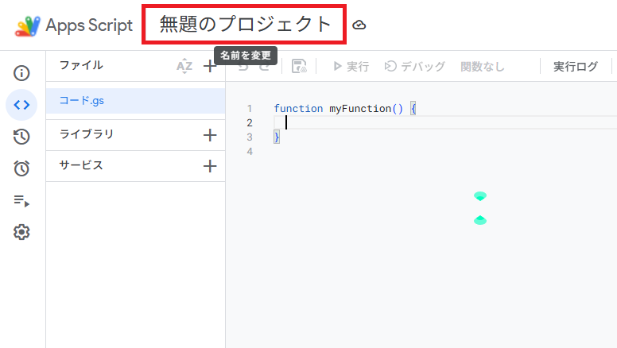<br>
<br>
プロジェクト名を変更し，「名前を変更」をクリックしてください．<br>
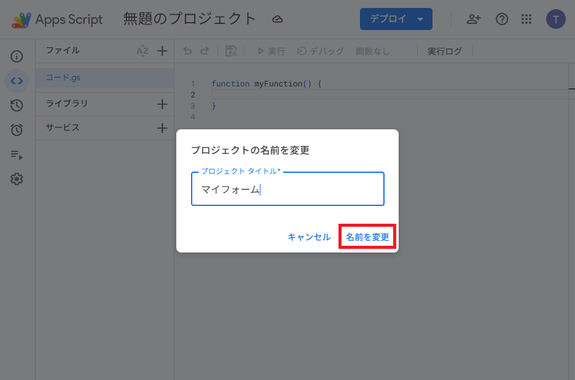

---

### 4. ライブラリの追加
「ライブラリ」の右にある「＋」をクリックしてください．<br>
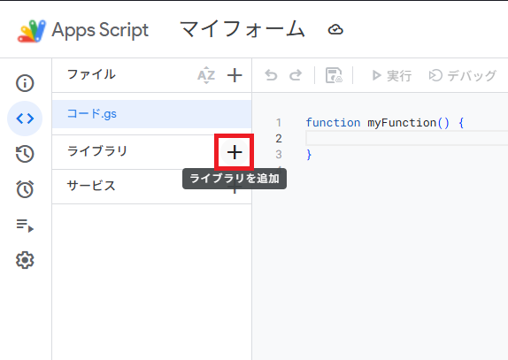<br>
<br>
スクリプトIDを入力し，「検索」をクリックしてください．（スクリプトIDは以下でコピーできます．）<br>

**スクリプトID**：`1lqOvEXcBEAAfzkD4aZGJjShQuhE7bcA3JlCZrCoaVzm-0qRNzXQG-14h`

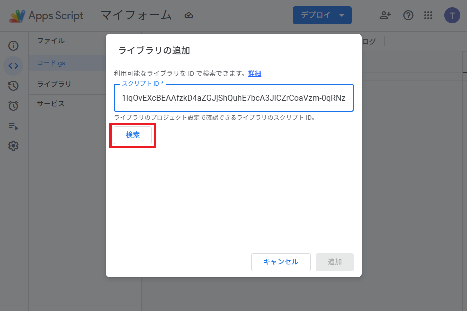<br>
<br>
最新の「バージョン」（一番大きな数字）を選択し，「追加」をクリックしてください．（IDは変更しないでください．）<br>
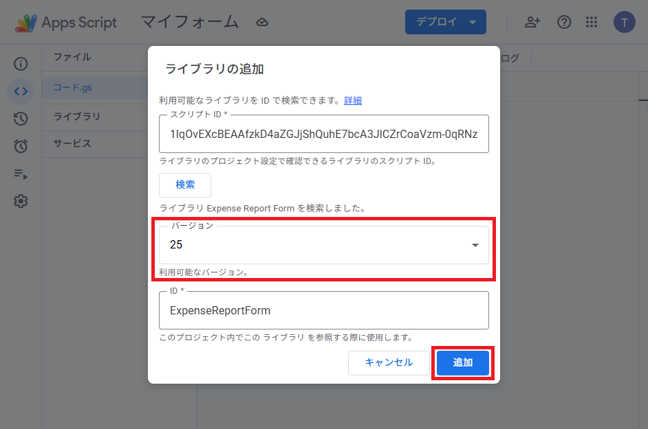<br>
<br>
ライブラリが追加されます．<br>
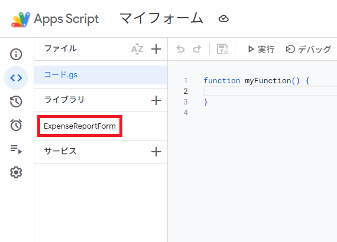<br>

---

### 5. コード.gsの編集
以下のコードスニペットから「コード.gs」の例をコピーしてください．

**コード.gs**
```
function initializeData () {
  
  //会計担当者へ/////////////////////////////

  // #1 適当なタイトルを設定してください．
  ExpenseReportForm.setTitle("経費精算申請フォーム");

  // #1.5 タイトル上の画像とファビコン，回答のデフォルトが設定可能です．
  // ※デフォルトで鳥科仕様になっているため，鳥科で利用する場合には設定不要です．
  // ExpenseReportForm.setTitleLogoUrl(); // タイトル上に表示される画像を設定できます．引数なしで実行すると，鳥科のロゴが表示されなくなります．設定例 : "https://lh3.googleusercontent.com/d/{画像のファイルID}"
  // ExpenseReportForm.setFabiconUrl(); // ファビコンを設定できます．引数なしで実行すると，GASのファビコンが適用されます．設定例 : "https://drive.google.com/uc?id={画像のファイルID}&.png"（こちら は拡張子必須です）
  // ExpenseReportForm.setDefaultName("-"); // 申請者の名前のデフォルトを設定できます．
  // ExpenseReportForm.setDefaultRetailer("-"); // 購入場所のデフォルトを設定できます．
  // ExpenseReportForm.setDefaultPurpose("-"); // 購入目的のデフォルトを設定できます．

  // #2 申請先のスプシの「シート名(ApplyTo)」と「項目(Category)」を追加してください．
  // スプシにない「シート名」は自動的にその名前で作成されます．
  ExpenseReportForm.addApplyTo("運営");
  ExpenseReportForm.addCategory("運営", "理大祭");
  ExpenseReportForm.addCategory("運営", "鳥コン");
  ExpenseReportForm.addCategory("運営", "新歓");
  ExpenseReportForm.addCategory("運営", "TF");
  ExpenseReportForm.addCategory("運営", "外部イベント");
  ExpenseReportForm.addCategory("運営", "ラジコン");
  ExpenseReportForm.addCategory("運営", "その他");

  ExpenseReportForm.addApplyTo("設計");
  ExpenseReportForm.addCategory("設計", "桁");
  ExpenseReportForm.addCategory("設計", "その他");

  ExpenseReportForm.addApplyTo("フラチ");
  ExpenseReportForm.addCategory("フラチ", "ハング");
  ExpenseReportForm.addCategory("フラチ", "レンタカー");

  ExpenseReportForm.addApplyTo("翼班");
  ExpenseReportForm.addCategory("翼班", "木材");
  ExpenseReportForm.addCategory("翼班", "スタイロ");
  ExpenseReportForm.addCategory("翼班", "プランク");
  ExpenseReportForm.addCategory("翼班", "フィルム");
  ExpenseReportForm.addCategory("翼班", "消耗品");
  ExpenseReportForm.addCategory("翼班", "レーザーカット");
  ExpenseReportForm.addCategory("翼班", "その他");

  ExpenseReportForm.addApplyTo("接合班");
  ExpenseReportForm.addCategory("接合班", "かんざし");
  ExpenseReportForm.addCategory("接合班", "積層");
  ExpenseReportForm.addCategory("接合班", "治具");
  ExpenseReportForm.addCategory("接合班", "木フラ");
  ExpenseReportForm.addCategory("接合班", "工具・ボルトなど");
  ExpenseReportForm.addCategory("接合班", "尾翼");
  ExpenseReportForm.addCategory("接合班", "ウィングレット");
  ExpenseReportForm.addCategory("接合班", "消耗品");
  ExpenseReportForm.addCategory("接合班", "その他");

  ExpenseReportForm.addApplyTo("コクピ班");
  ExpenseReportForm.addCategory("コクピ班", "キャノピー");
  ExpenseReportForm.addCategory("コクピ班", "御神体");
  ExpenseReportForm.addCategory("コクピ班", "カウル");
  ExpenseReportForm.addCategory("コクピ班", "フレーム");
  ExpenseReportForm.addCategory("コクピ班", "ハッチ");
  ExpenseReportForm.addCategory("コクピ班", "消耗品");
  ExpenseReportForm.addCategory("コクピ班", "その他");

  ExpenseReportForm.addApplyTo("電装班");
  ExpenseReportForm.addCategory("電装班", "基板");
  ExpenseReportForm.addCategory("電装班", "マイコン・IC・メモリなど");
  ExpenseReportForm.addCategory("電装班", "センサーなど");
  ExpenseReportForm.addCategory("電装班", "モーター・スピーカーなど");
  ExpenseReportForm.addCategory("電装班", "ケーブル・コネクタなど");
  ExpenseReportForm.addCategory("電装班", "LED・ディスプレイなど");
  ExpenseReportForm.addCategory("電装班", "抵抗・コンデンサーなど");
  ExpenseReportForm.addCategory("電装班", "電源・バッテリーなど");
  ExpenseReportForm.addCategory("電装班", "筐体・構造材料など");
  ExpenseReportForm.addCategory("電装班", "消耗品・固定具など");
  ExpenseReportForm.addCategory("電装班", "3Dプリンタ用品など");
  ExpenseReportForm.addCategory("電装班", "その他");
  ExpenseReportForm.addCategory("電装班", "シミュレーター");

  /////////////////////////////////////////

  return ExpenseReportForm.syncData();
}

function submit (records) {
  initializeData();
  return ExpenseReportForm.addData(records);
}

function doGet () {
  initializeData();
  return ExpenseReportForm.execute();
}
```
<br>
「コード.gs」の内容を全て消去してください．<br>
<br>
<br>
先程コピーした内容を貼り付けてください．<br>
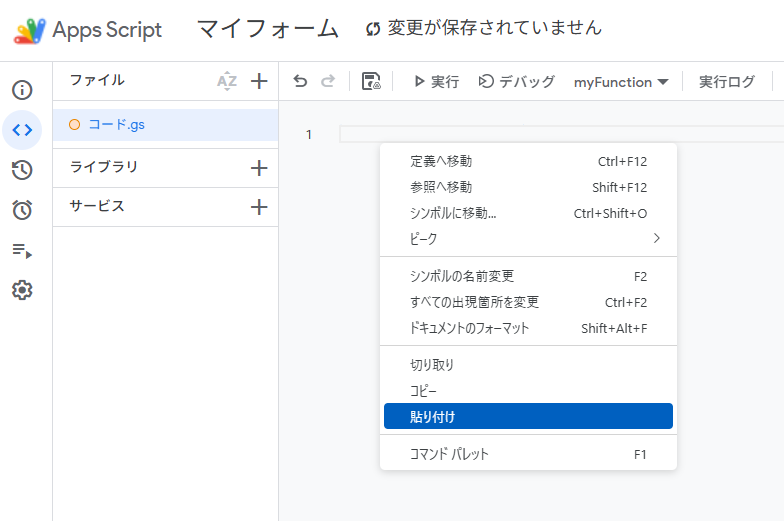<br>
<br>

以下のような関数を用いて，フォームをカスタマイズできます．

- ExpenseReportForm.setTitle()
  - タイトルを設定します．
- ExpenseReportForm.addApplyTo()
  - 申請先（班）を追加します．
- ExpenseReportForm.addCategory()
  - 項目を追加します．

以下は，鳥科では使用しません

- ExpenseReportForm.setTitleLogoUrl()
  - タイトル上に表示されるロゴを設定できます．
  - 無引数（カッコ内空欄）で呼び出すと，ロゴは非表示になります．
  - 設定例 : `ExpenseReportForm.setTitleLogoUrl(https://lh3.googleusercontent.com/d/{画像のファイルID});`
- ExpenseReportForm.setFabiconUrl()
  - ブラウザなどで表示されるファビコン（タイトルの戦闘に表示される小さなロゴ）を設定できます．
  - 無引数（カッコ内空欄）で呼び出すと，ファビコンはGoogle Apps Scriptのデフォルトになります．
  - 設定例 : `ExpenseReportForm.setFabiconUrl(https://drive.google.com/uc?id={画像のファイルID}&.png);`（こちらは拡張子必須です）
- ExpenseReportForm.setDefaultName();
  - 申請者の名前のデフォルトを設定できます．
- ExpenseReportForm.setDefaultRetailer();
  - 購入場所のデフォルトを設定できます．
- ExpenseReportForm.setDefaultPurpose();
  - 購入目的のデフォルトを設定できます．

---

### 7. プロジェクトの保存
「Ctrl+S」もしくはフロッピーディスクのボタンをクリックしてください．<br>
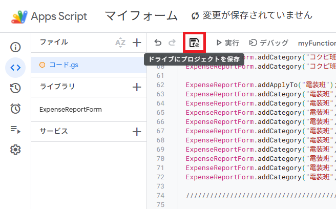

---

### 8. 初回デプロイ
「新しいデプロイ」をクリックしてください．<br>
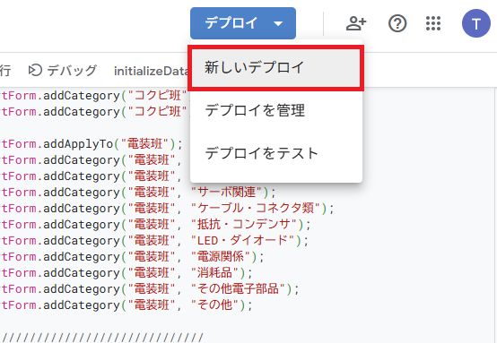<br>
<br>
「種類の選択」の右側にある歯車マークをクリックし，「ウェブアプリ」をクリックしてください．<br>
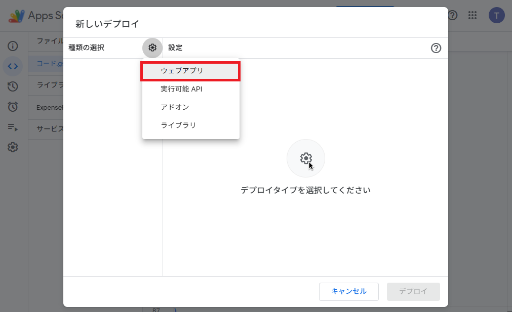<br>
<br>
「新しい説明文」を設定してください．<br>
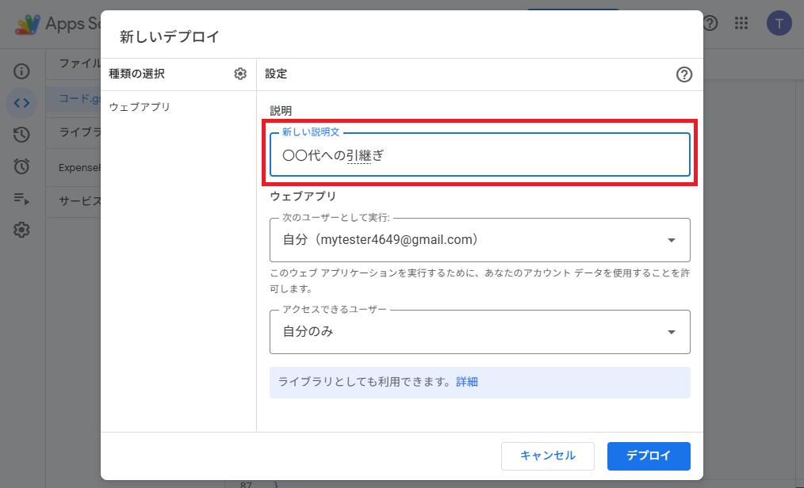<br>
<br>
「アクセスできるユーザー」を「全員」に変更し，「デプロイ」をクリックしてください．<br>
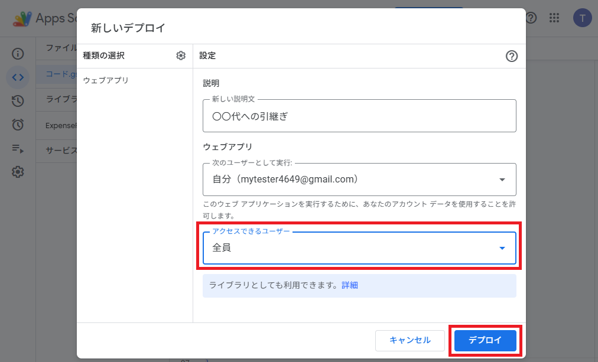<br>
<br>
「アクセスを承認」をクリックしてください．<br>
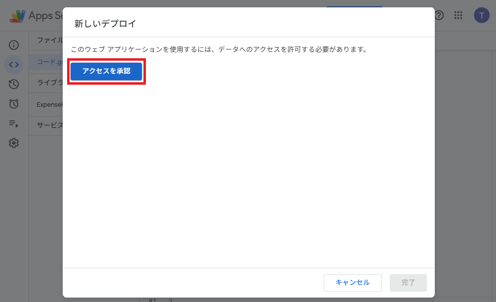<br>
<br>
会計用アカウントを選択してください．<br>
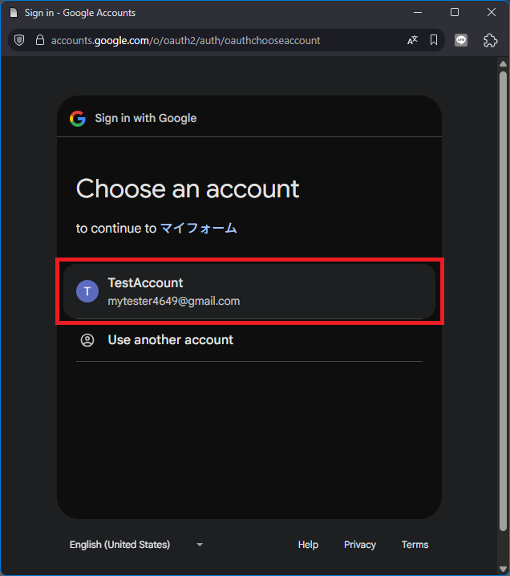<br>
<br>
「Google hasn’t verified this app」と表示される画面で，左下の「Advanced」をクリックしてください．<br>

<br>
開いたメニューにある「Go to（設定したプロジェクト名）」（画像では「Go to マイフォーム」 ）をクリックしてください．<br>
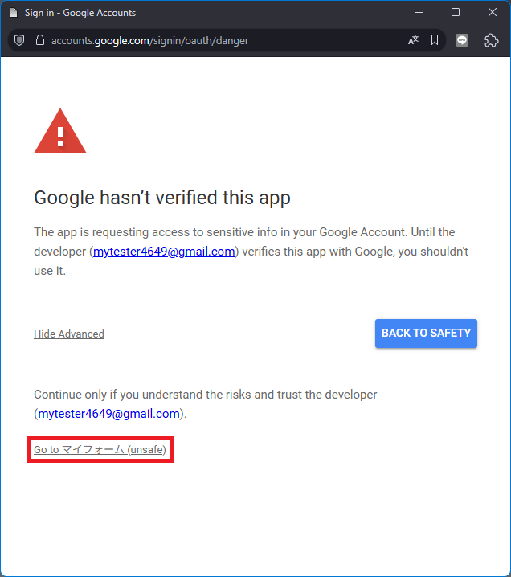<br>
<br>
「Allow」をクリックし，Googleアカウントへのアクセスを承認してください．<br>
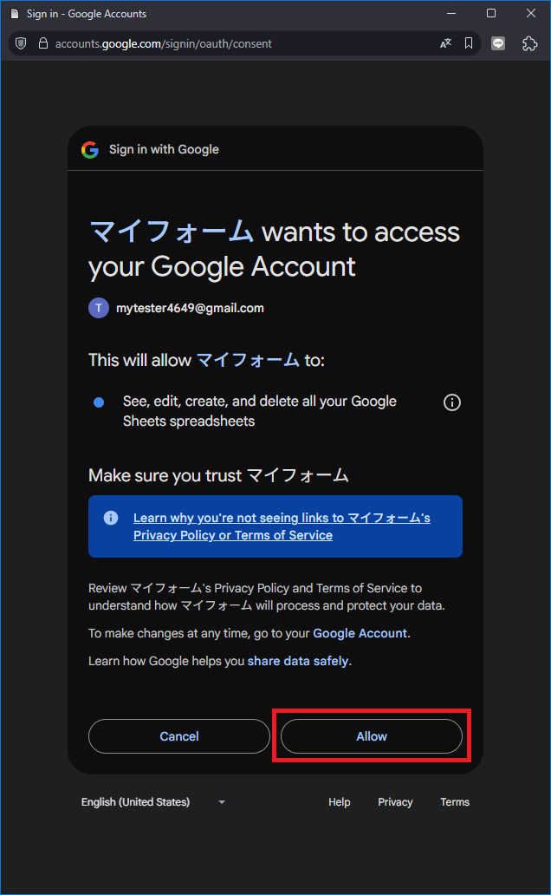<br>
<br>
デプロイが更新されます．「ウェブアプリ」のURLからフォームにアクセスできます．「完了」を押すと閉じることができます．<br>
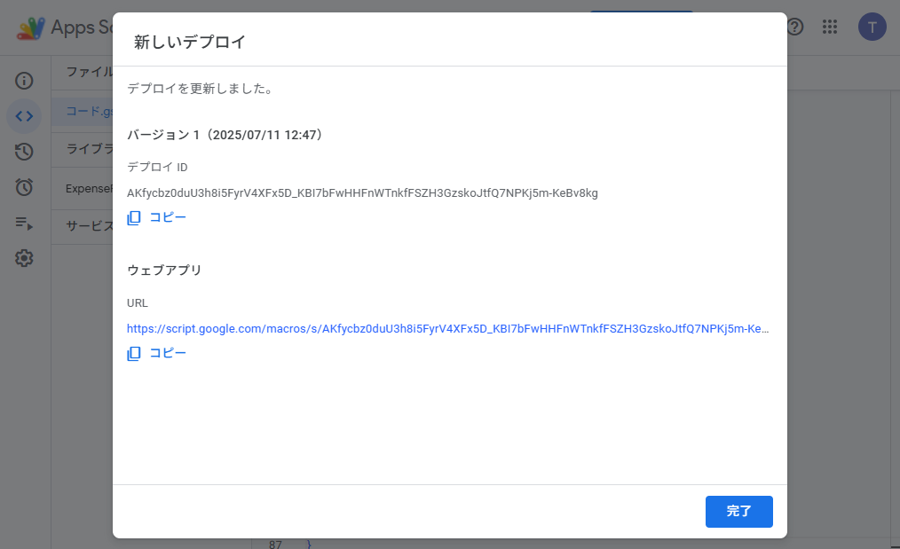<br>
<br>
フォームへアクセスするURLは「デプロイを管理」からも取得できます．<br>
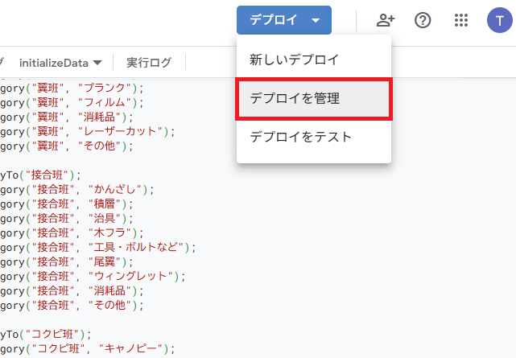<br>
<br>
「ウェブアプリ」のURLからフォームにアクセスできます．<br>
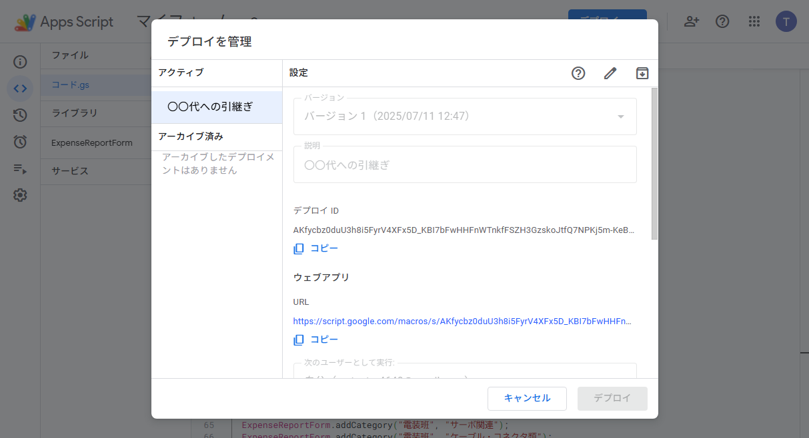<br>

---

## デプロイの更新
申請先（班）や項目を追加した場合に，その変更を適用する際はデプロイを更新する必要があります．  
以下の手順で，同じURLを使い続けつつ，変更を加えることができます．

---

### 0. ファイルの変更
「コード.gs」に変更を加え，プロジェクトを保存します．<br>
<br>

---

### 1. デプロイを編集
「デプロイを管理」を開いた後，ペンのマークの「編集」をクリックします．<br>
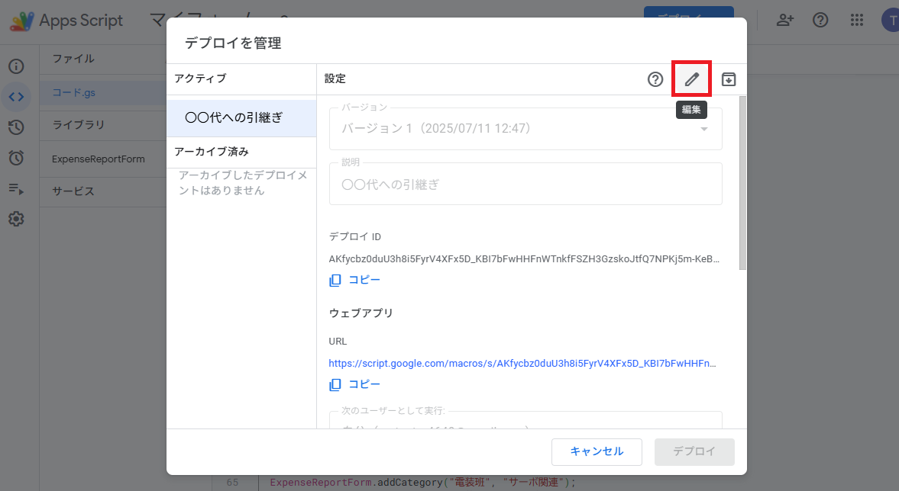<br>
<br>
バージョンを「新バージョン」に，説明も違うものに変更し，「デプロイ」をクリックします．<br>
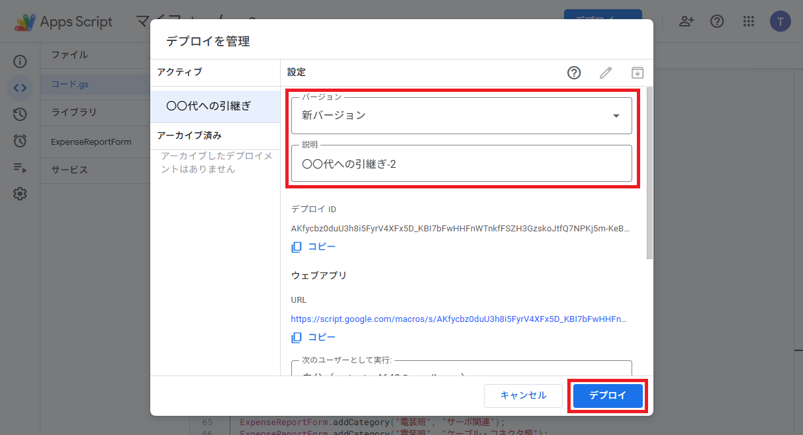<br>
<br>
デプロイが更新されます．「ウェブアプリ」のURLは同じですが，内容は変更されているはずです．<br>
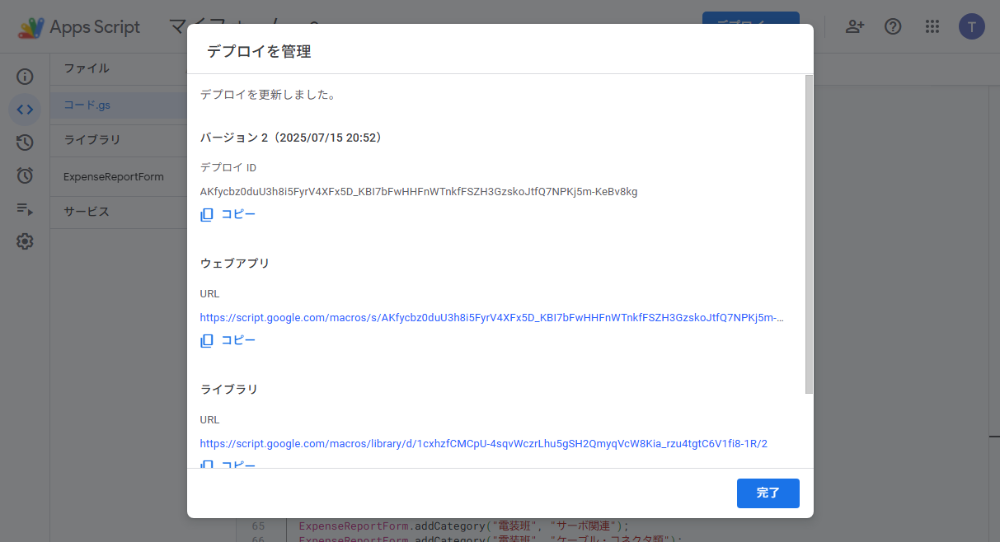<br>

---
