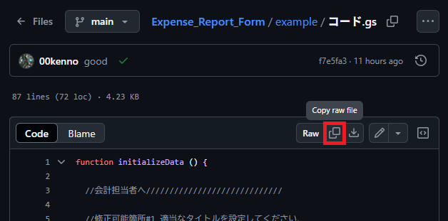

# 経費精算申請フォーム

## 概要
- 東京理科大学鳥人間サークル鳥科の経費精算申請フォームです．
- Googleスプレッドシートと直接接続します．
- 複数項目の送信，税率計算，申請先や購入場所の個別設定などに対応しています．
- 何かあれば制作者に[XのDM](https://x.com/MeganeKinoko_)やメール(irongolem0100@gmail.com)などで連絡してください．
> [!NOTE]
> このリポジトリ内のdocsはGitHub Pagesで公開されており，フォームのファビコンはここから取得しています．

## 更新履歴
- 2025-09-17:
  - 「割引額」入力欄の未入力チェックを無効化．
- 2025-07-11:
  - ライブラリのデプロイを利用する形式に変更．
- 2025-07-07:
  - 項目(Category)選択機能を実装．
  - アイテムが常に1つ以上存在するように修正．
  - 未入力欄の赤枠表示の問題を修正．
  - 警告メッセージの色を修正．
- 2025-05-31:
  - ファイルをアップロード．

## 引継ぎの方法
---

|0|Googleドライブを開く|
|:--|:--|
||会計用アカウントでログインしてください．|
||**<a href="https://drive.google.com/drive/my-drive" target="_blank" rel="noopener noreferrer">Googleドライブ</a>**|

---

|1|スプレッドシートの準備|
|:--|:--|
||画像下部のバーからシートを必要数作成し，適当なシート名に変更してください．作成したシートのシート名は後で使用します．|
|||

また，すべてのシートに以下のようなヘッダーを準備してください．
|タイムスタンプ|名前|項目|品名|単価|個数|単価×個数|別途消費税|送料・電車賃・代引き手数料|割引|請求金額|購入場所|購入目的|
|--|--|--|--|--|--|--|--|--|--|--|--|--|
|-|-|-|-|-|-|-|-|-|-|-|-|-|

---

|2|新しいプロジェクトの作成|
|:--|:--|
||「新規」→「その他」→「Google Apps Script」をクリックしてください．|
|||
||「スクリプトを作成」をクリックしてください．|
|||

---

|3|プロジェクト名の変更|
|:--|:--|
||「無題のプロジェクト」をクリックしてください．|
|||
||プロジェクト名を変更し，「名前を変更」をクリックしてください．|
|||

---

|4|ライブラリの追加|
|:--|:--|
||「ライブラリ」の右にある「＋」をクリックしてください．|
|||
||スクリプトIDを入力し，「検索」をクリックしてください．（スクリプトIDは以下でコピーできます．）|
|||
||最新の「バージョン」（一番大きな数字）を選択し，「追加」をクリックしてください．（IDは変更しないでください．）|
|||
||ライブラリが追加されます．|
|||

**スクリプトIDはこちらからコピーできます．**
```
1lqOvEXcBEAAfzkD4aZGJjShQuhE7bcA3JlCZrCoaVzm-0qRNzXQG-14h
```

---

|5|GitHub（<a href="https://github.com/00kenno/Expense_Report_Form/blob/main/example/%E3%82%B3%E3%83%BC%E3%83%89.gs" target="_blank" rel="noopener noreferrer">/example/コード.gs</a>）または以下のコードスニペットから「コード.gs」の例をコピーする|
|:--|:--|
|||

**コード.gs**
```
function initializeData () {
  
  //会計担当者へ/////////////////////////////

  //修正可能箇所#1 適当なタイトルを設定してください．
  ExpenseReportForm.setTitle("経費精算申請フォーム");

  //修正可能箇所#2 スプシのリンクを張ってください．(ex."https://docs.google.com/spreadsheets/d/.../edit")
  ExpenseReportForm.setSpreadSheetUrl("https://docs.google.com/spreadsheets/d/.../edit");

  //修正可能箇所#3 申請先のスプシの「シート名(ApplyTo)」と「項目(Category)」を追加してください．
  //ただし，「シート名」は確実にスプシの「シートの名前」と一致している必要があります．
  ExpenseReportForm.addApplyTo("運営");
  ExpenseReportForm.addCategory("運営", "理大祭");
  ExpenseReportForm.addCategory("運営", "鳥コン");
  ExpenseReportForm.addCategory("運営", "新歓");
  ExpenseReportForm.addCategory("運営", "TF");
  ExpenseReportForm.addCategory("運営", "外部イベント");
  ExpenseReportForm.addCategory("運営", "ラジコン");
  ExpenseReportForm.addCategory("運営", "その他");

  ExpenseReportForm.addApplyTo("設計");
  ExpenseReportForm.addCategory("設計", "桁");
  ExpenseReportForm.addCategory("設計", "その他");

  ExpenseReportForm.addApplyTo("フラチ");
  ExpenseReportForm.addCategory("フラチ", "ハング");
  ExpenseReportForm.addCategory("フラチ", "レンタカー");

  ExpenseReportForm.addApplyTo("翼班");
  ExpenseReportForm.addCategory("翼班", "木材");
  ExpenseReportForm.addCategory("翼班", "スタイロ");
  ExpenseReportForm.addCategory("翼班", "プランク");
  ExpenseReportForm.addCategory("翼班", "フィルム");
  ExpenseReportForm.addCategory("翼班", "消耗品");
  ExpenseReportForm.addCategory("翼班", "レーザーカット");
  ExpenseReportForm.addCategory("翼班", "その他");

  ExpenseReportForm.addApplyTo("接合班");
  ExpenseReportForm.addCategory("接合班", "かんざし");
  ExpenseReportForm.addCategory("接合班", "積層");
  ExpenseReportForm.addCategory("接合班", "治具");
  ExpenseReportForm.addCategory("接合班", "木フラ");
  ExpenseReportForm.addCategory("接合班", "工具・ボルトなど");
  ExpenseReportForm.addCategory("接合班", "尾翼");
  ExpenseReportForm.addCategory("接合班", "ウィングレット");
  ExpenseReportForm.addCategory("接合班", "消耗品");
  ExpenseReportForm.addCategory("接合班", "その他");

  ExpenseReportForm.addApplyTo("コクピ班");
  ExpenseReportForm.addCategory("コクピ班", "キャノピー");
  ExpenseReportForm.addCategory("コクピ班", "御神体");
  ExpenseReportForm.addCategory("コクピ班", "カウル");
  ExpenseReportForm.addCategory("コクピ班", "フレーム");
  ExpenseReportForm.addCategory("コクピ班", "ハッチ");
  ExpenseReportForm.addCategory("コクピ班", "消耗品");
  ExpenseReportForm.addCategory("コクピ班", "その他");

  ExpenseReportForm.addApplyTo("電装班");
  ExpenseReportForm.addCategory("電装班", "基板");
  ExpenseReportForm.addCategory("電装班", "マイコン");
  ExpenseReportForm.addCategory("電装班", "センサ類");
  ExpenseReportForm.addCategory("電装班", "サーボ関連");
  ExpenseReportForm.addCategory("電装班", "ケーブル・コネクタ類");
  ExpenseReportForm.addCategory("電装班", "抵抗・コンデンサ");
  ExpenseReportForm.addCategory("電装班", "LED・ダイオード");
  ExpenseReportForm.addCategory("電装班", "電源関係");
  ExpenseReportForm.addCategory("電装班", "消耗品");
  ExpenseReportForm.addCategory("電装班", "その他電子部品");
  ExpenseReportForm.addCategory("電装班", "その他");

  /////////////////////////////////////////

  return ExpenseReportForm.syncData();
}

function submit (records) {
  initializeData();
  return ExpenseReportForm.addData(records);
}

function doGet () {
  initializeData();
  return ExpenseReportForm.execute();
}
```

---

|6|「コード.gs」の編集|
|:--|:--|
||「コード.gs」の内容を全て消去してください．|
|||
||「5」でコピーした内容を貼り付けてください．|
|||

以下のような関数を用いて，フォームをカスタマイズします．
- ExpenseReportForm.setTitle()
  - タイトルを設定します．
- ExpenseReportForm.setSpreadSheetUrl()
  - スプシのURLを設定します．
> アドレスバーからコピーすると`https://docs.google.com/spreadsheets/d/.../edit?gid=xxxxxxxxx#gid=xxxxxxxxx`となっていることがほとんどですが，**"?"以下を省いた`https://docs.google.com/spreadsheets/d/.../edit`を設定してください．**
- ExpenseReportForm.addApplyTo()
  - 申請先（班）を追加します．**「1」で作成したシートの名前と完全に一致させてください．**
- ExpenseReportForm.addCategory()
  - 項目を追加します．

---

|7|プロジェクトの保存|
|:--|:--|
||「Ctrl+S」もしくはフロッピーディスクのボタンをクリックしてください．|
|||

---

|8|初回デプロイ|
|:--|:--|
||「新しいデプロイ」をクリックしてください．|
|||
||「種類の選択」の右側にある歯車マークをクリックし，「ウェブアプリ」をクリックしてください．|
|||
||「新しい説明文」を設定してください．|
|||
||「アクセスできるユーザー」を「全員」に変更し，「デプロイ」をクリックしてください．|
|||
||「アクセスを承認」をクリックしてください．|
|||
||会計用アカウントを選択してください．|
|||
||「Google hasn’t verified this app」と表示される画面で，左下の「Advanced」をクリックしてください．|
|||
||開いたメニューにある「Go to（設定したプロジェクト名）」（ここでは「Go to マイフォーム」 ）をクリックしてください．|
|||
||「Allow」をクリックし，Googleアカウントへのアクセスを承認してください．|
|||
||デプロイが更新されます．「ウェブアプリ」のURLからフォームにアクセスできます．「完了」を押すと閉じることができます．|
|||
||フォームへアクセスするURLは「デプロイを管理」からも取得できます．|
|||
||「ウェブアプリ」のURLからフォームにアクセスできます．|
|||

---

## デプロイの更新
申請先（班）や項目を追加した場合に，その変更を適用する際はデプロイを更新する必要があります．  
以下の手順で，同じURLを使い続けつつ，変更を加えることができます．

---

|0|ファイルの変更|
|:--|:--|
||「コード.gs」に変更を加え，プロジェクトを保存します．|
|||

---

|1|デプロイを編集|
|:--|:--|
||「デプロイを管理」を開いた後，ペンのマークの「編集」をクリックします．|
|||
||バージョンを「新バージョン」に，説明も違うものに変更し，「デプロイ」をクリックします．|
|||
||デプロイが更新されます．「ウェブアプリ」のURLは同じですが，内容は変更されているはずです．|
|||

---
